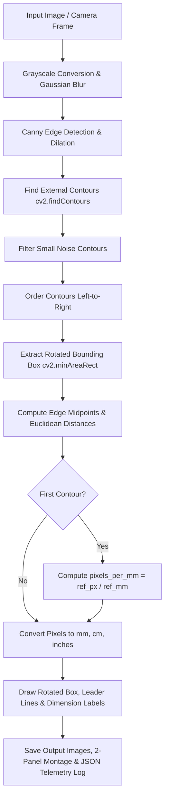

<div align="center">

# 📏 Real-Time Object Dimension Measurer

### *Day 12 — 30-Day Computer Vision & Deep Learning Challenge*

[](https://www.python.org/)
[](https://opencv.org/)
[](https://numpy.org/)
[](LICENSE)
[](https://github.com/manasha1232)

*Real-time computer vision system for measuring physical object dimensions (width & height in mm, cm, inches) using reference object calibration and rotated minimum bounding boxes.*

---

</div>

## 📌 Overview

The **Real-Time Object Dimension Measurer** calculates the physical dimensions of arbitrary objects placed on a surface. By using a single known reference object (e.g. credit card $85.6\text{ mm} \times 54.0\text{ mm}$, coin, or calibration marker), the system computes the pixel-to-millimeter ratio ($\text{pixels\_per\_mm}$) and outputs real-world width and height measurements for all surrounding items regardless of orientation.

### 🎯 Key Capabilities
- **Reference Object Metric Calibration**: Computes spatial scale dynamically using a reference item placed in the scene (`--ref-width 85.6`).
- **Rotated Minimum Area Bounding Boxes (`cv2.minAreaRect`)**: Handles objects tilted at arbitrary angles.
- **Euclidean Distance & Midpoint Geometry**: Computes corner-to-corner and edge-midpoint Euclidean distances.
- **Multi-Unit Output Conversions**: Outputs measurements simultaneously in millimeters ($\text{mm}$), centimeters ($\text{cm}$), and inches ($\text{in}$).
- **Automated Side-by-Side Visual Montages**: Generates 2-panel comparison views: `[Annotated Dimensions]` | `[Canny Edge Contour Mask]`.
- **JSON Telemetry Exporter**: Saves structured measurement logs detailing object IDs, bounding box coordinates, and real-world dimensions.

---

## 🏗️ System Architecture & Processing Pipeline



---

## 📐 Mathematical Formulation

### 1. Pixel-to-Metric Scale Ratio Calculation
Given a reference object of known physical width $W_{\text{ref\_mm}}$ and detected pixel width $W_{\text{ref\_px}}$:

$$\text{Scale} = \frac{W_{\text{ref\_px}}}{W_{\text{ref\_mm}}} \quad (\text{pixels per mm})$$

### 2. Rotated Minimum Area Bounding Box Midpoints
For corner coordinates $(TL, TR, BR, BL)$, the edge midpoints are:

$$M_{\text{top}} = \left(\frac{x_{tl} + x_{tr}}{2}, \frac{y_{tl} + y_{tr}}{2}\right), \quad M_{\text{bottom}} = \left(\frac{x_{bl} + x_{br}}{2}, \frac{y_{bl} + y_{br}}{2}\right)$$

### 3. Euclidean Distance & Real-World Dimensions

$$D_{\text{px}} = \sqrt{(x_1 - x_2)^2 + (y_1 - y_2)^2}$$

$$\text{Dimension}_{\text{mm}} = \frac{D_{\text{px}}}{\text{Scale}}, \quad \text{Dimension}_{\text{cm}} = \frac{\text{Dimension}_{\text{mm}}}{10}, \quad \text{Dimension}_{\text{in}} = \frac{\text{Dimension}_{\text{mm}}}{25.4}$$

---

## 📁 Repository Structure

```text
realtime_object_dimension_measurer/
├── dimension_measurer.py     # Core dimension measuring engine & HUD renderer
├── generate_demo_objects.py   # Synthetic test bench image generator
├── requirements.txt           # Dependency declarations (opencv-python, numpy, matplotlib)
├── README.md                  # Project documentation
├── input/                     # Input images dataset
│   └── sample_objects_table.jpg
└── output/                    # Measured output images & JSON reports
    ├── sample_objects_table_dimensions.jpg
    ├── sample_objects_table_comparison.jpg
    └── sample_objects_table_dimension_report.json
```

---

## ⚡ Quickstart & Installation

### 1. Install Dependencies
```bash
pip install -r requirements.txt
```

### 2. Generate Synthetic Test Bench Image
```bash
python generate_demo_objects.py
```

### 3. Measure Object Dimensions
```bash
python dimension_measurer.py --input input/sample_objects_table.jpg --output output --ref-width 85.6
```

---

## 📊 Telemetry Output Specification

```json
{
    "filename": "sample_objects_table.jpg",
    "total_objects_measured": 6,
    "pixels_per_mm": 1.4486,
    "processing_time_sec": 0.1541,
    "objects": [
        {
            "id": 1,
            "is_reference": true,
            "dimensions_mm": {"width": 85.6, "height": 11.7},
            "dimensions_cm": {"width": 8.56, "height": 1.17},
            "dimensions_in": {"width": 3.37, "height": 0.46}
        }
    ]
}
```

---

## 👤 Author & Challenge Context

- **Challenge**: Day 12 of [30-Day Computer Vision & Deep Learning Challenge](https://github.com/manasha1232/30-Day-Computer-Vision-Challenge)
- **Author**: [@manasha1232](https://github.com/manasha1232)
- **License**: MIT License
